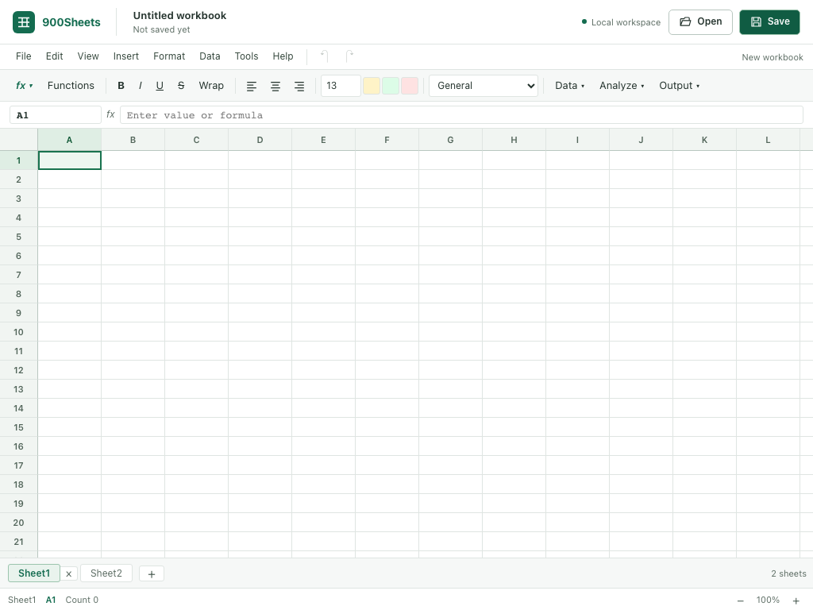

# 900Sheets

900Sheets is a free, local-first desktop spreadsheet editor. It supports formulas, formatting, common exchange formats, and continued editing without an account, subscription, telemetry, or constant internet access.

## Why it exists

900 Labs builds open-source tools for people and communities priced out of modern software. Spreadsheets are basic working infrastructure for schools, small businesses, researchers, public services, and community organizations. 900Sheets is designed to remain useful on an ordinary computer and when an internet connection is unavailable.

## Current release

Version 0.5.0 focuses on practical community use and safer distribution:

- A virtualized grid covering all 1,000,000 rows and 16,384 columns supported by the workbook engine
- **Go To** navigation for a cell or range from `A1` through `XFD1000000`
- Export preflight that reports scale, warns before large dense work, and blocks exports above established safety limits
- A **Recovery and Backups** panel for inspecting, restoring, and deleting retained crash-recovery snapshots
- Configurable recovery autosave timing and a separate five-version rotating backup set for each saved native workbook
- Four starter templates with invented data, plus a local first-run guide
- Persisted English, Swedish, and Spanish grid-navigation labels, clearer keyboard focus, and screen-reader grid semantics
- XLSX import and export for the supported validation and conditional-formatting subset
- A release workflow capable of producing macOS and Windows artifacts, with platform signing when maintainers provide release credentials

The v0.4.0 workbook-safety work remains in place: cross-sheet formulas, workbook-wide cycle checks, bounded atomic undo and redo, stable sheet identities, native recovery, and LibreOffice-backed XLSX checks. The editor also includes a formula library, formatting, find and replace, filters, pivots, chart previews, validation, conditional formatting, named ranges, frozen panes, comments, protection, print settings, and PDF output.

Read [Compatibility and known limitations](docs/COMPATIBILITY.md) before using 900Sheets for important work. Release provenance files state whether a macOS artifact was Developer ID signed and notarized or ad hoc signed, and whether a Windows installer was Authenticode signed or unsigned. Do not infer signing from the filename alone.

The ongoing product-readiness work is tracked in the [audit and validation record](docs/audits/2026-09-07-product-readiness.md), [acceptance criteria](docs/PRODUCT_CRITERIA.md), and [commercial/open-source comparison](docs/COMPETITOR_RESEARCH.md). Older-computer usability is an explicit test target; it is not yet a verified hardware-support claim.



Editor layout at 1024 × 768, captured from the browser UI regression fixture with an empty workbook and mocked Tauri commands. For a practical first task, insert **School Budget**, change the planned and actual amounts, review the remaining funds, then save as `.900sheets`.

## Install and run

### Release artifacts

The v0.5.0 release workflow is configured to build a macOS app archive and a Windows NSIS installer, then verify their hashes and provenance. Automated GitHub Release publication requires the macOS app to be Developer ID signed, accepted by Apple notarization, stapled, and reverified. Check the release page and the included provenance file before installing.

On macOS, the workflow uses Developer ID signing and notarization only when the required Apple credentials are present. Otherwise it produces an explicitly marked ad hoc signed, non-notarized archive for workflow inspection, but refuses to publish it as a GitHub Release asset. On Windows, the workflow uses Authenticode only when the configured signing certificate is present. An unsigned installer may be published only with explicit unsigned provenance. These are workflow capabilities, not proof that a particular release artifact completed those paths. Only use artifacts published by the `900Labs/900Sheets` repository.

### Build from source

Prerequisites:

- Rust 1.92.0, pinned by `rust-toolchain.toml`
- Node.js 20.19 or newer, 22.12 or newer, or 24 or newer
- The [Tauri v2 system prerequisites](https://v2.tauri.app/start/prerequisites/)

```bash
git clone https://github.com/900Labs/900Sheets.git
cd 900Sheets
npm ci --prefix apps/desktop
npm run tauri:dev --prefix apps/desktop
```

### Build a macOS app bundle

On macOS, create the `.app` bundle with:

```bash
npm run tauri:build --prefix apps/desktop
```

That command creates a local macOS bundle. It does not reproduce hosted signing, notarization, provenance, or release publication unless the required credentials and workflow steps are also used.

### Validate Windows or Linux source

After installing the Tauri prerequisites for the host platform, run the source checks and compile the desktop target without packaging:

```bash
npm ci --prefix apps/desktop
npm run check --prefix apps/desktop
npm run build --prefix apps/desktop
cargo test -p sheets-desktop --lib
cargo build --release -p sheets-desktop
```

The final command builds the Rust desktop target for the current host. It is not an installer or distribution package.

## How to use it

1. Start with a blank workbook or choose a school budget, small-business accounts, community project, or household planning template.
2. Select a cell and type a value or a formula such as `=SUM(A1:A10)`.
3. Refer to another sheet with `=Data!A1` or `=SUM('Annual Budget'!$A$1:$A$12)`.
4. Press Ctrl+G, Command+G, or F5 and enter an address such as `B25000` or `A1:F20` to navigate directly.
5. Use the sheet tabs and menus to organize sheets, format data, and apply data tools.
6. Choose **File > Save Workbook** to create or update an editable `.900sheets` file. After the primary save succeeds, 900Sheets attempts to create a rotating local backup and reports any backup-maintenance failure separately.
7. Choose **Open XLSX** or **Open JSON** to replace the current workbook with imported content. Save afterward as `.900sheets` if you want to keep editing.
8. Choose **Import CSV** to add CSV or TSV data to the active sheet as one undoable transaction.
9. Review the preflight message before exporting XLSX, CSV, JSON, or PDF exchange files.

### Recovery and undo

After a successful edit, 900Sheets waits for the configured interval, flushes pending mutations, and writes a recovery snapshot to the app data directory. The default interval is 750 milliseconds. Recovery files are separate from the workbook you opened. A normal native save retires the corresponding recovery.

The **Recovery and Backups** panel lists retained snapshots and their sheet summaries without replacing the current workbook. You can restore or delete one explicitly. Startup recovery remains available, and restoring one snapshot does not delete unrelated snapshots. Save a restored workbook to keep it as a normal `.900sheets` file.

Recovery protects dirty session state after a crash or interrupted close. Rotating backups are different: after each successful native save, 900Sheets attempts to create a private backup and retain up to five versions for that saved document. A backup failure never changes a completed primary save and is shown to the user. The backup manager can inspect, restore, or delete retained versions. Neither feature replaces an external backup policy for important files.

Undo history is bounded to 100 transactions, 64 MiB in aggregate, 32 MiB per transaction, and 200,000 changed coordinates per transaction. An operation that exceeds a per-transaction limit is rejected without partially changing the live workbook.

The full walkthrough is in the [User guide](docs/USER_GUIDE.md).

## Platform support

| Platform | v0.5.0 workflow status |
| --- | --- |
| macOS | Workflow builds a `.app` archive; automated publication requires Developer ID signing, accepted notarization, stapling, and verification; the ad hoc fallback is inspection-only |
| Windows | Workflow builds an NSIS installer; Authenticode requires a configured certificate, otherwise provenance marks the installer unsigned |
| Linux | Source and backend checks are supported; no Linux distribution package is configured for v0.5.0 |

Source builds may work on Tauri-supported systems once their platform prerequisites are installed. Workflow configuration is not a clean-machine test result. Consult the release notes for the exact artifacts and verification completed for a specific tag.

## Development

The repository is a Rust workspace with a Svelte 5 and Tauri v2 desktop application:

```text
apps/desktop/             Desktop UI and Tauri command boundary
crates/sheets-core/       Workbook, sheet, cell, formatting, and data tools
crates/sheets-formula/    Formula parser, evaluator, functions, and dependencies
crates/sheets-xlsx/       XLSX import and export
crates/sheets-csv/        CSV import and export
crates/sheets-json/       JSON exchange and native workbook format
crates/sheets-chart/      Chart data and SVG previews
crates/sheets-pivot/      Pivot engine
crates/sheets-validation/ Validation and conditional formatting
crates/sheets-i18n/       Locale and accessibility helpers
crates/sheets-print/      Print layout and PDF output
crates/sheets-advanced/   Protection, goal seek, scenarios, and comments
```

See [Architecture](docs/ARCHITECTURE.md) for transaction, recovery, and dependency-graph design.

## Quality gate

Run the complete local gate before opening a pull request:

```bash
./scripts/verify-local.sh
```

The gate includes Rust formatting, clippy and workspace tests, frontend checks/build/unit/browser tests, and enforced frontend asset budgets. Current run evidence is recorded in the [audit](docs/audits/2026-09-07-product-readiness.md). Browser tests exercise the UI through mocked Tauri commands; Rust tests cover backend behavior. CI requires LibreOffice for the external round trip; local systems without `soffice` report a skip. Hosted platform, native application and packaging results remain separate evidence.

See the [versioned compatibility matrix](docs/COMPATIBILITY_MATRIX.md) for exact fixture and regression IDs.

## Contributing and support

- [Contributing guide](CONTRIBUTING.md)
- [Support guide](SUPPORT.md)
- [Security policy](SECURITY.md)
- [Documentation index](docs/README.md)
- [Release process](docs/RELEASING.md)

Bug reports, compatibility fixtures made with invented data, translations, documentation improvements, and focused performance work are welcome.

## License

900Sheets is licensed under the Apache License 2.0. See [LICENSE](LICENSE).
